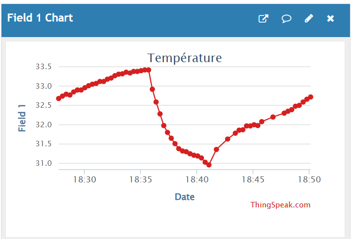
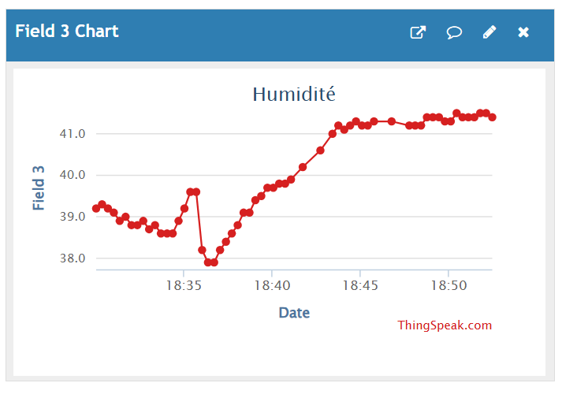
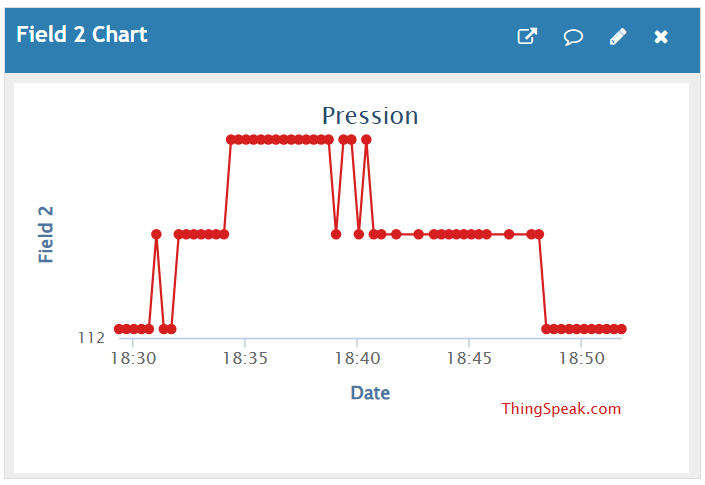

# IoT Projet – Arduino MKR IoT Carrier

## Description
Ce projet utilise le kit Oplà (Arduino MKR WiFi 1010 + MKR IoT Carrier) pour mesurer :
- la température
- l’humidité
- la pression atmosphérique

Les données sont envoyées sur ThingSpeak.

## 📊 Visualisation des données via ThingSpeak

### 🌡️ Température

### 💧 Humidité

### 🧭 Pression atmosphérique

